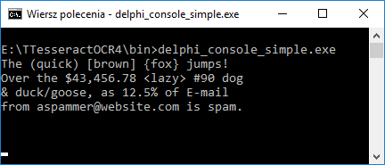
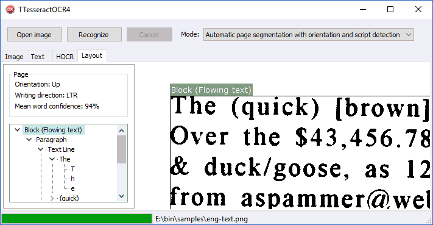

# TTesseractOCR4

TTesseractOCR4 is a Object Pascal binding for [tesseract-ocr](https://github.com/tesseract-ocr/tesseract) 4.x - an optical character recognition engine.

## Building examples
Examples were tested in Delphi 10.2.3 (32-bit build for Windows) and Lazarus 1.8 (32-bit build for Windows and Linux in Ubuntu 18.04).

1. Clone this repository to a local folder.
2. Obtain Tesseract 4.x binaries. I recommend using latest version, build from master branch of the tesseract project. 
  - Windows: Precompiled binaries can be found in `lib\tesseractocr-master.zip`. Unpack and copy all DLL files to `bin\`.  
  [*Microsoft Visual C++ 2017 Redistributable x86*](https://go.microsoft.com/fwlink/?LinkId=746571) must be installed on the computer.  
  - Linux: `sudo apt install tesseract-ocr`.  
  This will also install required shared libraries (liblept5 and libtesseract4).
  - Common: Set `{$DEFINE USE_CPPAN_BINARIES}` accordingly in `tesseractocr.consts.pas` if using Tesseract libraries built with CPPAN (defined as default).
3. Download trained language data files from [tesseract-ocr/tessdata/](https://github.com/tesseract-ocr/tessdata/) to `bin\tessdata`.  
All examples in this repository require English data file ([`eng.traineddata`](https://github.com/tesseract-ocr/tessdata/blob/master/eng.traineddata)).  
Additionally `examples\delphi-console-pdfconvert` example requires [`osd.traineddata`](https://github.com/tesseract-ocr/tessdata/blob/master/osd.traineddata) and [`pdf.ttf`](https://github.com/tesseract-ocr/tesseract/blob/master/tessdata/pdf.ttf) files.  
Linux: Tested with language data from [tesseract-ocr/tessdata_fast](https://github.com/tesseract-ocr/tessdata_fast)
4. Open and compile example project: 
   - `examples\delphi-console-simple`. Recognize text in `samples\eng-text.png` and write to console output
   
   
   - `examples\delphi-vcl-image`  
     
   4 tabs: 
      - Image: View input image
      - Text: Recognized text coded as UTF-8
      - HOCR: Recognized text in HTML format
      - Layout: View page layout (paragraphs, text lines, words...) 
    
   - `examples\delphi-console-pdfconvert`. Convert `samples\multi-page.tif` (multiple page image file) to a PDF file
   - `examples\lazarus-console-simple`. `examples\delphi-console-simple` for Lazarus 

## License
MIT
